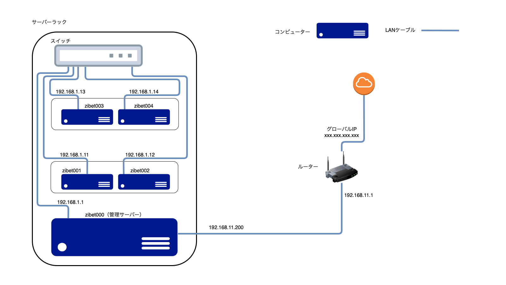

# 並列計算機を組んだときの手順（執筆途中）

# 目的

研究室内で使われていない計算機サーバを用いて、新たに並列計算機を作ること。また、研究室のメンバーにLinuxの基礎知識（主にコマンド）を経験してもらい、並列計算機の利用しやすい環境を作ること。


スライド（githubでは非公開）：

1. 計算機の中身とLinuxの基本
2. OSのInstallと設定
3. IPとssh接続など
4. ネットワークの設定


# 1.Ubuntuのインストール

USBメモリ経由でUbuntuを計算機にインストールします。
今回、計算機は5台あるのでそれぞれに対して行なってください。
※この章では、Windowsを使って操作してください。

1. [公式ページ](https://jp.ubuntu.com/download)から**Ubuntu Desktop 20.04.x LTS**をダウンロードします。（ここで，xは任意の数字です。）サーバー版でも構いません。
   ファイルサイズが大きいため、ダウンロードには結構時間がかかるかもしれません。
   ダウンロードしたファイルの拡張子が.isoであり、**isoイメージ**と呼んだりします。
   （※ LTS = Long Term Service、長期的にサポートされるバージョンのこと）

2. ダウンロードしたisoイメージをUSBメモリに書き込むために、[Rufus](https://rufus.ie/ja/)を使います。
    ただ、isoイメージをコピペではダメなことに注意してください。
    また、この操作を行うと、USBメモリの中身が全て消えるので注意してください。


  USBメモリを普段使いするために、リフォーマットする必要があるかもしれません。


3. isoイメージが書き込まれたUSBメモリを計算機に差し込み、電源をつけます。
    このままでは既にあるOSが起動するので、BIOS画面からUSBメモリからOSを起動するように設定します。
    BIOS画面に行くためには、ロゴが表示されたあとファンクションキー（大抵、F12かF2）を連打すればいけるはずです。


4. BIOSはマザーボードによって異なりますが、**起動オプション**の設定項目があるはずです。
   起動の優先度をUSBメモリが一番上になるように設定してください。


5. Ubuntuが起動するので、インストールを選びます。デフォルト設定で大丈夫です。
   今回，ユーザー名は**z-user**として話を進めます。


6. インストールできたら、USBメモリを抜いて再起動します。


### FAQ

Q. サーバーからピーピー音がする。

A. インストールしたUbuntuによって、ハードウェアRAIDの構成が壊れた可能性があるので、再構成します。
　 計算機に電源入れたあと、「WebBIOSを開くには〇〇を押してください（in English）」といった指示に従ってください。
　 MEGA-RAIDというRAIDを使用しているようなので、この[資料](https://jp.fujitsu.com/platform/server/primergy/products/note/svsdvd/dvd/pdf/megaraid_sas_12g_software_jp.pdf)が役に立ちました。

　

# 2.基本ソフトのインストール

Linux（Ubuntu）では、**ターミナル**を使ってソフトウェアをインストールすることができます。
ターミナル起動のショートカットは「**Alt + Ctr + T** 」です。まずは、ターミナルを立ち上げてください。
インターネット経由で行うので、LANケーブルをルーターに指すなどしてインターネットへ接続してください。
LANケーブルの差し込み口が複数あると思いますが、今はどれを使っても大丈夫です。
5 以外、全ての計算機でインストールしてください。


0. **事前準備**

   ```shell
   $ sudo apt update
   $ sudo apt upgrade
   ```

1. **sshサーバーのインストール**
   SSH接続を受け付けるようにします。

   ```shell
   $ sudo apt install openssh-server
   ```

   インストールすると、自動的にsshサーバー(sshd)が起動するはずですが、次のように手動でも起動できます。

   ```shell
   $ sudo /etc/init.d/ssh restart
   ```

2. **gitのインストール**（管理ノードだけでもOK）

   ```shell
   $ sudo apt install git
   ```

3. **vimのインストール**
   ファイルを書き換えるエディタです。emcasやnanoなどもあります。

   ```shell
   $ sudo apt install vim
   ```

4. **ネットワークツールのインストール**

   ```shell
   $ sudo apt install net-tools
   ```

5. **Ansibleのインストール**（**管理ノードのみ**）

   ```shell
   $ sudo apt install software-properties-common
   $ sudo apt-add-repository --yes --update ppa:ansible/ansible
   $ sudo apt install ansible
   ```


# 3.ネットワークなどの設定

並列計算機を構成するコンピュータでプライベートネットワークを構築します。
並列計算機を構成するコンピュータは１台の**管理ノード（master）**と複数台の**計算ノード（slave）**から構成されます。それぞれの設定が**異なるときがある**ので、注意してください。（特に表記がない限りどちらにも同じ設定を行ってください）

最終的な目標は次のようなネットワーク構成です。




（この図は https://diagrams.net で作成し、このレポジトリの NetworkDiagram.drawio として保存してあります。）

流れとしては，IPアドレスなどを設定し、LANケーブルを繋ぐ必要があります。

1. **IPアドレスの設定**
   Ubuntu 20.04 LTSでは、IPアドレスは /etc/netplan/ にあるyamlファイルからで設定できます。
   yamlファイルは辞書順に最後のものが有効になるので、デフォルトの設定を次のようにコピーした後，編集します。

   （※Desktop版かServer版かによって、ファイル名が異なるかもしれません。）

   ```shell
   $ sudo cp /etc/netplan/00-network-manager-all.yaml /etc/netplan/99-network-manager-all.yaml
   ```

   vimで編集します。

   ```shell
   $ sudo vim /etc/netplan/99-network-manager-all.yaml
   ```

   編集した後が、次のようになっていることを確認してください。
   ※ここで、no1やno2、enp2s0f0などはネットワークインターフェース名で、デバイスによって異なる場合があります。LANケーブルの差し込み口の名前と考えてください。ネットワークインターフェース名の調べ方は[こちら](#FAQ-2)

   #### 管理ノード

   ```shell
   $ cat /etc/netplan/99-network-manager-all.yaml
   
   network:
     version: 2
     ethernets:
       eno1:
         addresses: [192.168.11.200/24]
         gateway4: 192.168.11.1
         dhcp4: no
         dhcp6: no
         nameservers:
           addresses: [192.168.11.1]
       eno2:
         addresses: [192.168.1.1/24]
   ```

   192.168.11.1はルーターのIPアドレスです。


   #### 計算ノード

   ```shell
   $ cat /etc/netplan/99-network-manager-all.yaml

   network:
     version: 2
     ethernets:
       enp2s0f0:
         addresses: [192.168.1.xxx/24]
         gateway4: 192.168.1.1
         nameservers:
           addresses: [192.168.11.1]
       enp2s0f1:
           dhcp4: yes
           dhcp6: yes
   ```

   ※ xxx = それぞれのIPアドレス （今回は、11,12,13,14のいづれか）として読み替えてください。


   次のコマンドでIPアドレスの変更を反映させます。

   ``` shell
   $ sudo netplan apply
   ```

   今の段階では、計算ノードからはインターネットにアクセスできないかもしれません。


2. **管理ノードのNATの設定**

   計算ノードからインターネットにアクセスできるように、NATを設定します。

   （LinuxではIPマスカレードと呼ぶらしい）


   計算ノード（例えば、192.168.1.11）のゲートウェイは管理ノード（192.168.1.1）なので、インターネットにアクセスしようとすると、192.168.1.11（計算ノード）→192.168.1.1（管理ノード）とデータが流れます。ここでNATを設定することで、管理ノードは計算ノードからのデータを自分からのデータとして変換するので、

   192.168.1.11（計算ノード）→192.168.1.1（管理ノード）→192.168.1.200（管理ノード）→192.11.1（ルーター）→インターネット

   となり、計算ノードからインターネットへとアクセスできるようです。

   （試行錯誤で設定したので、正確ではない説明かもしれません）


   IPマスカレードを有効にします。

   ```shell
   $ sudo vim /etc/sysctl.conf
   $ cat /etc/sysctl.conf
   （略）
   net.ipv4.ip_forward=1
   ```


   ```shell
   $ sudo sysctl -p
   ```

   IPマスカレードを設定します。

   ```shell
   $ sudo iptables -t nat -A POSTROUTING -s 192.168.1.0/24 -j MASQUERADE
   ```

   次のコマンドで確認できます。

   ```shell
   $ sudo iptables -L -t nat
   〜（略）〜
   Chain POSTROUTING (policy ACCEPT)
   target      port opt source          destination
   MASQUERADE   all  -- 192.168.1.0/24   anywhere
   ```

   MASQUERADEの行では、192.168.1.0/24 のネットワークからの通信を自身からの通信へと変換してくれる設定になっていることw確認できます。
   この時点でインターネットにつながってるはずです。計算ノードからウェブサイトなどへpingを試してください。


   このままでは再起動すると無効化されるので、設定が永久に反映させるようにします。

   ```shell
   # Yesで全て答えればよい
   $ sudo apt install iptables-persistent
   ```


   ```shell
   $ sudo iptables-save -c | sudo tee /etc/iptables/rules.v4
   ```


3. **IPアドレスとホスト名の対応**
   管理ノードの `/etc/hosts` は NIS（後述） により計算ノードと共有するように後で設定するので、**管理ノードのみ**で編集します。

   ```shell
   $ sudo vim /etc/hosts
   ```


   ```shell
   $ cat /etc/hosts
   127.0.0.1 localhost
   127.0.0.1 zibet000
   192.168.1.1  zibet000
   192.168.1.11 zibet001
   192.168.1.12 zibet002
   192.168.1.13 zibet003
   192.168.1.14 zibet004

   〜（略）〜
   ```

4. 最終確認として、`ssh z-user@zibet001`などとして接続してみてください。接続できれば成功です。

### FAQ

・ネットワークインターフェース名の調べ方

``` shell
$ ip address show #略して ip a s も可

＜省略＞
2: eno1: <BROAADCAST,MULTICASTUP,LOWER_UP> mtu 1500 qdisc mq state UP ...
...
3: eno2:
```

ここで、eno1やeno2がネットワークインターフェース名です。LANケーブルでルーターと接続し、IPアドレスが設定されれば、IPアドレスも表示されます。どの差し込み口がどの名前かは LANケーブルを刺したり抜いたりして特定ください。
また、ネットワークにつながっていれば、 **state UP**。繋がっていなければ、**state DOWN**と表示されます。


# Ansible

Ansibleとは、Python製のインフラ構築自動化ツールです。
管理ノードにインストールし、管理対象ノードにssh接続できる環境とPython環境があれば利用できます。
Ansibleには主に、対象ノードを記述する**インベントリファイル**と何を行うかを記述する**プレイブック**が必要になります。

このリポジトリの構成は次のようになっています。（README.mdなどは除く）

```
/cluster_setup
   |-- playbook.yaml（プレイブックファイル）
   |-- hosts（iniフォーマットで書かれた、インベントリファイル）
   |
   |-- tasks/
   |      -- nsf.yaml
   |      -- setup_clusters.yaml
   |      -- allshutdown.yaml
   |
   |-- vars/
   |      -- package_pbs.yaml（PBSをインストールするのに必要なパッケージを定義した変数ファイル）
   |
   |-- script/
   |      -- allshutdown.sh（計算機を全てシャットダウンするためのスクリプト）
   |
   |-- conf/（設定ファイル）
          -- defaultdomain
          -- exports
```

今回は、（基本的なソフトを除いて）Ansible経由でライブラリなどをインストールします。そのための作業がyaml形式で書いてあります。
yamlを使わず、全て手作業で行っても大丈夫です。


#### 事前準備

Ansibleでは、ターゲットノードにssh接続します。**--ask-pass**オプションでAnsibleを実行する際にssh接続のパスワードを入力することもできますが、パスワードを省略することができるので、その設定を行います。

##### 管理ノード

``` shell
$ ssh-keygen -t rsa #（色々聞かれるが、Enter２回おす、空白でOK）
$ ssh-copy-id -i ~/.ssh/id_rsa.pub z-user@ipアドレス #管理ノードと計算ノード全てに対して行う
```

管理ノード上で鍵（`~/.ssh/id_rsa.pub`）を作成し、計算ノードの`~/.ssh/authorized_keys`にコピーします。これでパスワード入力なしに、計算ノードへとssh接続できます。
後に管理ノードの`/home/`を計算ノードと共有するので、管理ノード自身へも鍵をコピーします。


#### FAQ

Q. NISでYPBINDPROC_DOMAIN: Domain not boundというエラーが出た。

A. 様々な原因がありえますが、計算ノードでのNISのインストールをAnsibleで行ったため、
　 ドメイン名が計算クラスタのホストネーム（zibet001など）になってしまっていたことが原因でした。

Q. NFSで管理ノードでサーバーが起動できない。

A. `sudo /etc/init.d/nfd-kernel-server status` でエラーコードなどを確認できる。
　 今回のエラーは`Failed to stat /home/share: No such file or directory`とディレクトリがなかった。
　※ 最初、`/home/`が全て共有されると計算ノードにssh接続できなかったので、`/home/share`というディレクトリを作って共有しようとしていた。

# NIS

# OpenPBSのインストール

OpenPBSとは、パッチジョブ管理システムのOSSであり、複数のユーザーが並列計算機にプログラムを投げたときに、空いている計算リソースをうまく活用するように取り計らうソフトウェアです。
（現在、研究室のメイン計算機ではTorque PBSというPBSソフトが動いています。）

インストール方法は公式の[github](https://github.com/openpbs/openpbs/blob/master/INSTALL)から確認できます。
次の１と２は、Ansibleを使ってインストールできるようにファイルを用意しました。


 1. 管理ノードに必要なソフトウェアをインストールする。

    ```shell
    $ sudo apt install gcc make libtool libhwloc-dev libx11-dev \
          libxt-dev libedit-dev libical-dev ncurses-dev perl \
          postgresql-server-dev-all postgresql-contrib python3-dev tcl-dev tk-dev swig \
          libexpat-dev libssl-dev libxext-dev libxft-dev autoconf \
          automake g++
    ```

2. 管理ノードと計算ノード両方に必要なソフトをインストールする。

    ```shell
    $ apt install expat libedit2 postgresql python3 postgresql-contrib sendmail-bin \
          sudo tcl tk libical3 postgresql-server-dev-all libhwloc-dev
    ```

    （※公式には載っていないが、libhwloc-devも必要だった）

    1と2に関しては`ansible-playbook tasks/install_pbs_package.yaml -i hosts --ask-become-pass` で必要なパッケージをインストールできるようにしてあります。

3. 公式のソースからコンパイルする。
    ここでは一般ユーザ権限で実行する。

    ``` shell
    $ mkdir ~/pbs
    # 公式からクローン
    $ git clone https://www.github.com/openpbs/openpbs.git ~/pbs/
    $ cd ~/pbs
    $ ./autogen.sh # configureファイルやmakefileを作成
    $ ./configure -prefix=/opt/pbs
    $ make # 時間が少しかかる
    ```

4. rootユーザでインストールを完了させる。

    ```shell
    $ sudo make install
    $ sudo /opt/pbs/libexec/pbs_postinstall
    ```

5. PBSの設定を行う。

    ``` shell
    $ sudo vim /etc/pbs.conf
    # デフォルトで大丈夫そうだった
    $ cat /etc/pbs.conf
    PBS_SERVER=zibet000
    PBS_START_SERVER=1
    PBS_START_SCHED=1
    PBS_START_COMM=1
    PBS_START_MOM=0
    PBS_EXEC=/opt/pbs
    PBS_HOME=/var/spool/pbs
    PBS_CORE_LIMIT=unlimited
    PBS_SCP=/usr/bin/scp
    ```

6. 権限を設定する

    ```shell
    $ sudo chmod 4755 /opt/pbs/sbin/pbs_iff /opt/pbs/sbin/pbs_rcp
    ```

7. PBSの再起動

    ```shell
    $sudo /etc/init.d/pbs start
    ```

8. PBSのパスを通す。

    ```shell
    # ファイルの末尾に、export PATH=/opt/pbs/bin:/opt/pbs/sbin:$PATH を追加
    $ vim ~/.bashrc
    $ source ~/.bashrc
    ```


次は、**計算ノードでの作業**になります。

1. 計算ノードでのPBSのインストールをします。（**全ての**計算ノードで行います。）

	``` shell
	$ ssh z-user@192.168.1.xxx # xxxは適宜読み替えてください
	$ sudo /opt/pbs/libexec/pbs_postinstall # /opt/下は管理ノードと共有されている
	```

2. PSBの設定を行います。

	```shell
	$ sudo vi /etc/pbs.conf
	$ cat /etc/pbs.conf
	PBS_SERVER=zibet000
	PBS_START_SERVER=0
	PBS_START_SCHED=0
	PBS_START_COMM=0
	PBS_START_MOM=1
	PBS_EXEC=/opt/pbs
	PBS_HOME=/var/spool/pbs
	PBS_CORE_LIMIT=unlimited
	PBS_SCP=/usr/bin/scp
	```

3. PBSを起動します。

	```shell
	$ sudo /etc/init.d/pbs/start
	```


# OpenMPIのインストール

OpenMPIは、MPIに準拠したOSSライブラリで、今回これをインストールします。複数種類のMPIをインストールすると競合が起こるようなので注意したほうが良さそうです。

1. 公式サイトからソースコードのダウンロード

   ```shell
   $ mkdir ~/mpi
   $ git clone --recursive https://github.com/open-mpi/ompi.git ~/mpi/
   $ cd ~/mpi
   ```

2. コンパイルの準備

   ```shell
   $ ./autogen.pl
   # configureにあたって、必要なパッケージのインストール
   # configureでエラーが出たら、何か足りないかもしれない...
   $ sudo apt install flex
   $ sudo apt install pandoc
   # 5,6分ほどかかった。インストール先はNFSで共有する/usr/local/の下
   $ ./configure --prefix=/usr/local/openmpi-5.1 CC=gcc CXX=g++ FC=gfortran
   ```

3. インストール

   ```shell
   # 20分ほどかかった
   # ルート権限でないとパーミッションエラーが出た
   $ sudo make all install
   ```


# LINPACKの実行（makeでエラー中）

スパコンの性能評価として，LINPACKというベンチマークソフトを用いることがあります。世界中のスパコンの性能をまとめた https://www.top500.org から確認できます。（日本の，富岳や京などもあります。）

1. BLASのインストール（全てのノードで実行）

   ``` shell
   $ sudo apt install libopenblas-dev -y
   ```


2. LINPACKのソースコードのダウンロード

   ```shell
   $ wget http://www.netlib.org/benchmark/hpl/hpl-2.2.tar.gz
   $ mkdir ~/hpl
   $ tar zxf hpl-2.2.tar.gz -C ~/hpl
   $ cd ~/hpl/hpl-2.2
   ```


3.

# お世話になったサイト

・[自作クラスタ計算機]([http://www2.yukawa.kyoto-u.ac.jp/~koudai.sugimoto/dokuwiki/doku.php?id=%E8%87%AA%E4%BD%9C%E3%82%AF%E3%83%A9%E3%82%B9%E3%82%BF%E8%A8%88%E7%AE%97%E6%A9%9F](http://www2.yukawa.kyoto-u.ac.jp/~koudai.sugimoto/dokuwiki/doku.php?id=自作クラスタ計算機))
